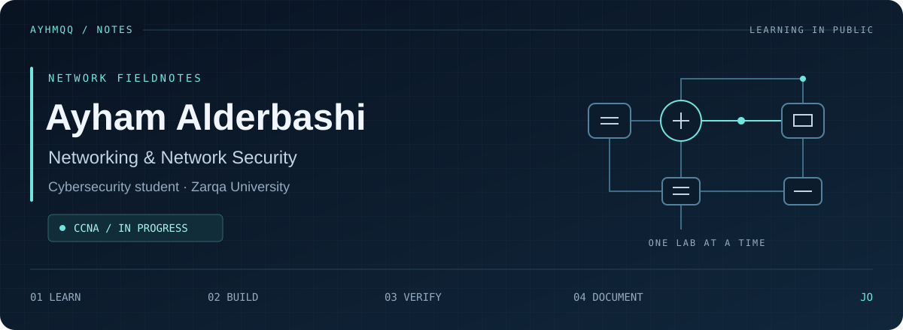
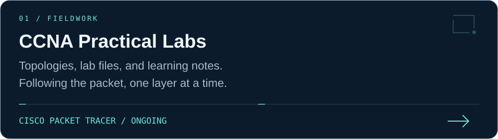
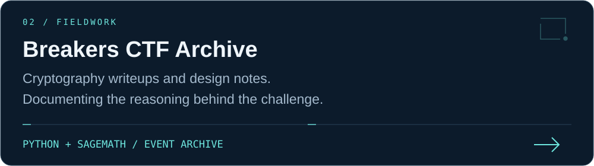
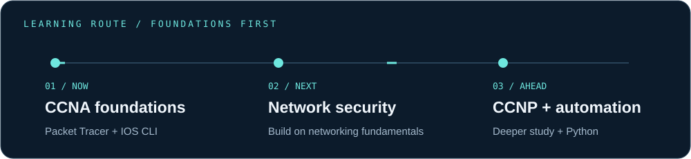
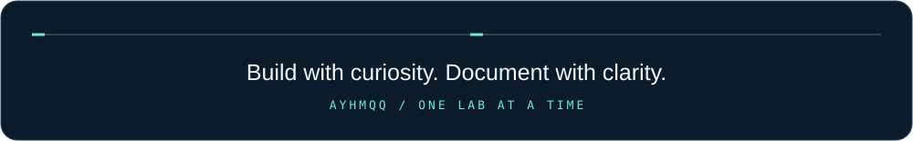

  

  <a href="https://github.com/AyhmQQ/CCNA-Practical-Labs">Explore my CCNA labs</a> &nbsp;·&nbsp;
  <a href="https://github.com/AyhmQQ/BRK-CYS-2026-CTF-Writeups">Read my CTF writeups</a> &nbsp;·&nbsp;
  <a href="https://www.linkedin.com/in/ayhmqq/">Connect on LinkedIn</a>

## About this notebook

I'm **Ayham**, a cybersecurity student at **Zarqa University, Jordan**, working toward a career in **networking and network security**. I use this space to document practical work, explain what I learn, and improve one lab at a time.

I'm currently **studying for the CCNA**, with my exam planned for the end of 2026. My next goals are deeper networking study through **CCNP** and **network automation with Python**.

## 01 / Selected fieldwork

**Start with the labs:** [Device placement](https://github.com/AyhmQQ/CCNA-Practical-Labs/tree/main/Lab_01_Packet_Tracer_Introduction) · [Cabling](https://github.com/AyhmQQ/CCNA-Practical-Labs/tree/main/Lab_02_Cabling_and_Distances) · [OSI traffic analysis](https://github.com/AyhmQQ/CCNA-Practical-Labs/tree/main/Lab_03_OSI_Model_Traffic_Analysis)

## 02 / My learning route

<strong>Open my learning notebook</strong>

| Area | Where I am |
| :--- | :--- |
| Networking | Studying CCNA concepts through Cisco Packet Tracer and IOS CLI practice |
| Programming | Python, Java, and web development coursework |
| Data | Database coursework |
| Cryptography | CTF participation, challenge writing, and documenting ideas |
| Next steps | Build stronger networking foundations, then deepen network security and automation skills |

My approach: understand the concept, build a small lab, inspect the behavior, and write down what I learned.

## 03 / People & projects

- **Founder & Team Lead · Breakers** — I founded a volunteer student technology team and help coordinate learning activities, workshops, and CTFs, including introductory Linux and Bash sessions.
- **Head of Leaders · NASA Space Apps Irbid** — Part of the local organizing team.
- **ERP system work · Sense Makeup** — Evaluating user workflows, documenting issues, and suggesting process improvements.

## 04 / Education

**Cybersecurity · Zarqa University**  
Expected graduation: **February 2029** · GPA: **85/100 (Excellent)**  
Coursework: Computer Networks, Databases, Python, Java, and Web Development.

---

I'm interested in opportunities to learn, collaborate, and gain practical experience in networking and network security. **[Let's connect on LinkedIn.](https://www.linkedin.com/in/ayhmqq/)**

